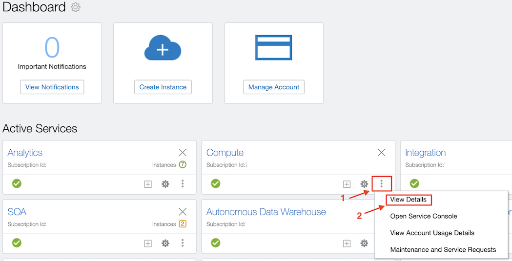
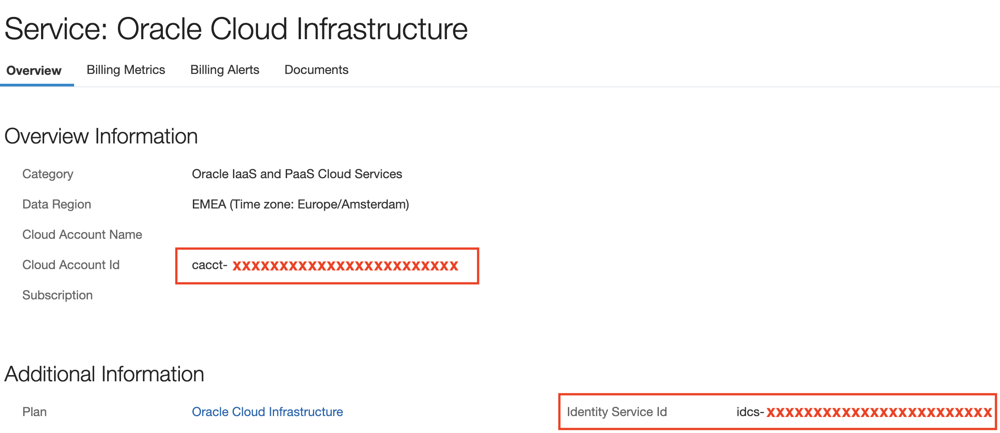

# Get your OCI billing details

Oracle Cloud Account Metering REST APIs expose a lot of useful information about our Oracle Cloud account via REST APIs. 
    We can, for example, check our subscription details, credit promotions, resource usage, cost and quotas. 
    All we need to test the REST APIs is cURL, a command-line utility for sending HTTP requests. 

- get_balance.py

        Get account balance: Purchased, Balance, Consumed

        This script needs config.ini : Username/Password/Tenant

- get_monthly.py

        Get Oracle cloud monthly charge for given date range

        This script needs config.ini : Username/Password/Tenant

- get_usage.py

        Get Oracle cloud detailed usage costs for given date range

        This script needs config.ini : Username/Password/Tenant

- get_CompCost.py

        Get Oracle cloud usage costs per compartments for given date range

        This script needs :

            config.ini : Username/Password/Tenant

            compartments.ini : Compartments list

- get_TagCost.py

        Get Oracle cloud usage costs per tag for given date range

        This script needs :

            config.ini : Username/Password/Tenant

            tags.ini : tags list

Pre Requisites:

    - Python 3.6 or +
    - Your Oracle Cloud Account / Tenant Name
    - IDCS User with Business Admin Role
    - Your IDCS identifiers

To retrieve your IDs:

    - Cloud Account Id:    cacct-xxxxxxxxxxxxxxxxxxxxxx
    - Identity Service Id: idcs-xxxxxxxxxxxxxxxxxxxxxxx

Goto :
https://myservices-YOUR-TENANT-NAME.console.oraclecloud.com/mycloud/cloudportal/dashboard

# Select Compute details:

# Find your IDs :

Inspired by Martin Bridge code
	
		https://github.com/bridgem