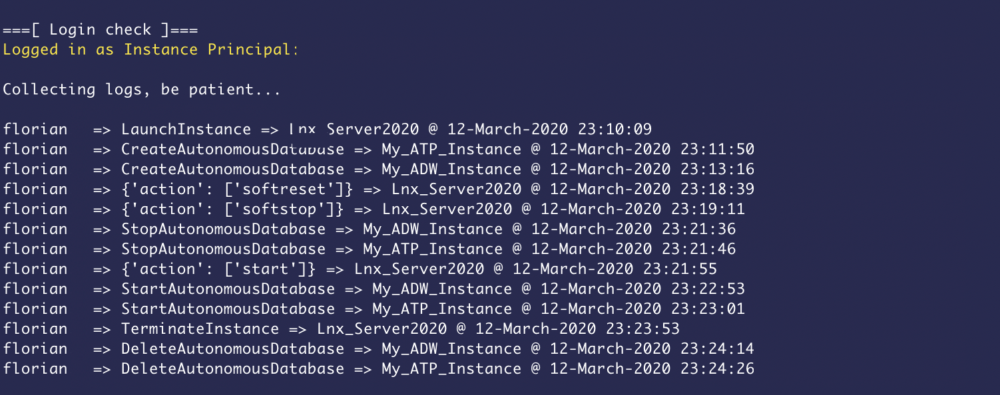

# oci-audit

This script retrieves action logs about Compute/Database/Autonomous instances 
from the audit logs & for a specific compartment.

- Action Logs collected :

        - Create Autonomous Database
        - Delete Autonomous Database
        - Start Autonomous Database 
        - Stop Autonomous Database
        - Launch DbSystem
        - Terminate DbSystem
        - Launch Compute Instance
        - Start/Stop Compute Instance
        - Terminate Compute Instance

- Config file Authentication

        If OCI-CLI is installed, you can authenticate with your config file

        profile = "DEFAULT"
        configfile = "/home/opc/.oci/config"

        If this script is launched from an OCI instance, you can leverage Instance Principal Authentication

        use_instance_principal = 'TRUE'
        tenancy_id_instance_principal = "ocid1.tenancy.oc1..aaaaaa..."
        
        ref: https://docs.cloud.oracle.com/en-us/iaas/Content/Identity/Tasks/callingservicesfrominstances.htm

- Prerequisites

        - Linux instance
        - Python 3.6+

- Config file example

        [DEFAULT]
        user=ocid1.user.oc1..aaaaaaaaxxxxxxxxxxxxxxxxxxxxxxxxxxxxxx
        fingerprint=76:22:76:5c:33:12:1b:5c:82:95:5c:11:0a:30:a0:07
        key_file=/home/opc/.oci/config/my_api_key.pem
        pass_phrase=here_your_key_file_passphrase
        tenancy=ocid1.tenancy.oc1..aaaaaaaaxxxxxxxxxxxxxxxxxxxxxxxxxxxxxx
        region=eu-frankfurt-1

		ref: https://docs.cloud.oracle.com/en-us/iaas/Content/API/SDKDocs/cliinstall.htm

