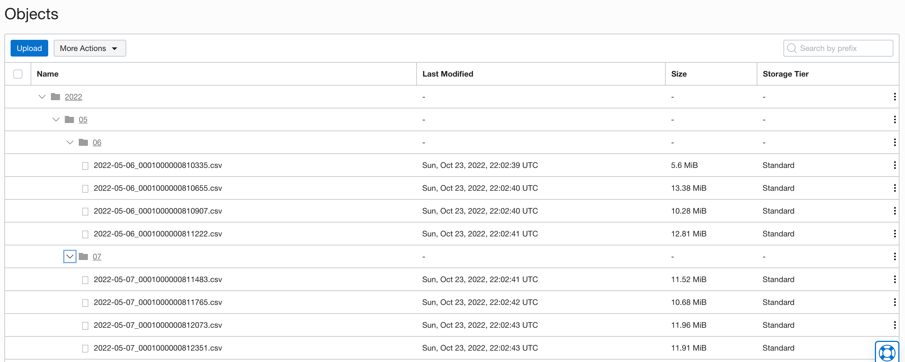
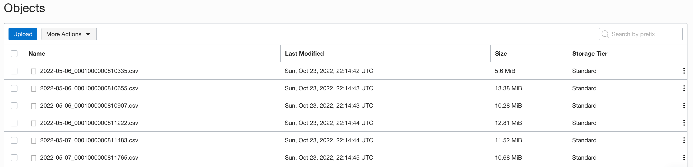
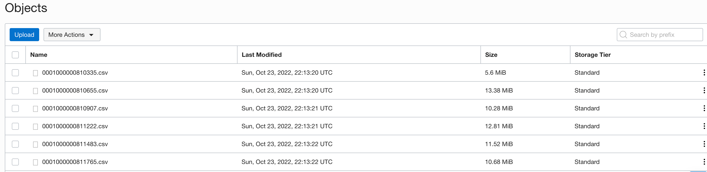

# oci-dl-reports.py

## @author: Florian Bonneville, 
    Oct. 24th 2022
    version: 1.0
    Bug report, questions, comments: (mailto:olygo.git@gmail.com?subject=[GitHub oci-dl-reports] Source Han Sans)

***DISCLAIMER – This is not an official Oracle application,  It does not supported by Oracle Support.***

This script downloads & extracts your OCI Cost Reports into your own bucket for the current month (default) or for a specified month & year (arguments).

##  optional arguments:

	-auth IP                >   authenticate through OCI Instance_Principal (default)
	-auth CS                >   authenticate through OCI Cloud Shell
	-auth CF                >   authenticate through OCI Config file
	-cf /path_to_file       >   specify config file location if not in default location
	-p profile_name         >   specify which profile to use in the config file if many exists
	-dest local             >   download into a local folder only, default push to OCI
	-init True              >   download all reports from the last 6 months
	-m mm                   >   download reports for month mm (01, 02,...)
	-y yyyy                 >   download reports for year yyyy (2021, 2022,...)
	-hist True              >   start analysis from last downloaded file, this reduce script duration
	-f xxxxxxx              >   start analysis after a specific file name, format: reports/cost-csv/0001000000760749.csv.gz
	-pr reports/usage-csv   >   download cost reports (reports/cost-csv) or usage reports (reports/usage-csv)
	-wf /path-to-my-dir     >   reports folder location, default is ~/YOUR_TENANT_NAME_cost_reports/
	-cp My-Comp-Name        >   specify the compartment name where to store your bucket, default is your root compartment
	-bn My-Bucket-Name      >   specify the bucket name to store your reports, default is "reports_YOUR_TENANT_NAME"
	-tag False              >   do not add the date Prefix "YYYYMM" to each report
	-tree False             >   do not organize reports in date tree: /YEAR/MONTH/DAY/xxxxreport.csv

## Command line examples:

	default will push the .csv cost reports for the current month into a bucket in your root compartment, using Instance_Principal authentication)
	python3 ./oci-dl-reports.py
	   
	authenticate through your oci config file
	python3 ./oci-dl-reports.py -auth CF -cf ~/.oci/config -p DEFAULT
	   
	authenticate through oci cloud shell
	python3 ./oci-dl-reports.py -auth CS 
	   
	if you want to download all available reports (max 6 months old):
	python3 ./oci-dl-reports.py -init True
	 
	download reports for a specific month: 
	python3 ./oci-dl-reports.py -m 09 -y 2022
	
	download reports for a specific month into a specific compartment & bucket 
	python3 ./oci-dl-reports.py -cp COMPARTMENT_NAME -bn BUCKET_NAME -m 09 -y 2022
	
	download reports locally only & for a specific month
	python3 ./oci-dl-reports.py -dest Local -m 09 -y 2022
	
	by defaut a date prefix is added to each report and reports are stored in folder using a date tree i.e 2022/09/01/2022-09-01_0001000001055191-00001.csv, you can disable both prefix taging and tree storage
	python3 ./oci-dl-reports.py -tag False -tree False

## Prerequisites

	tested from Oracle Linux 7 >
	sudo yum install python3
	pip3 install --upgrade pip oci-cli oci --user
   
## Download reports using prefix tags & tree

## Download reports without tree

## Download reports without tags & tree

