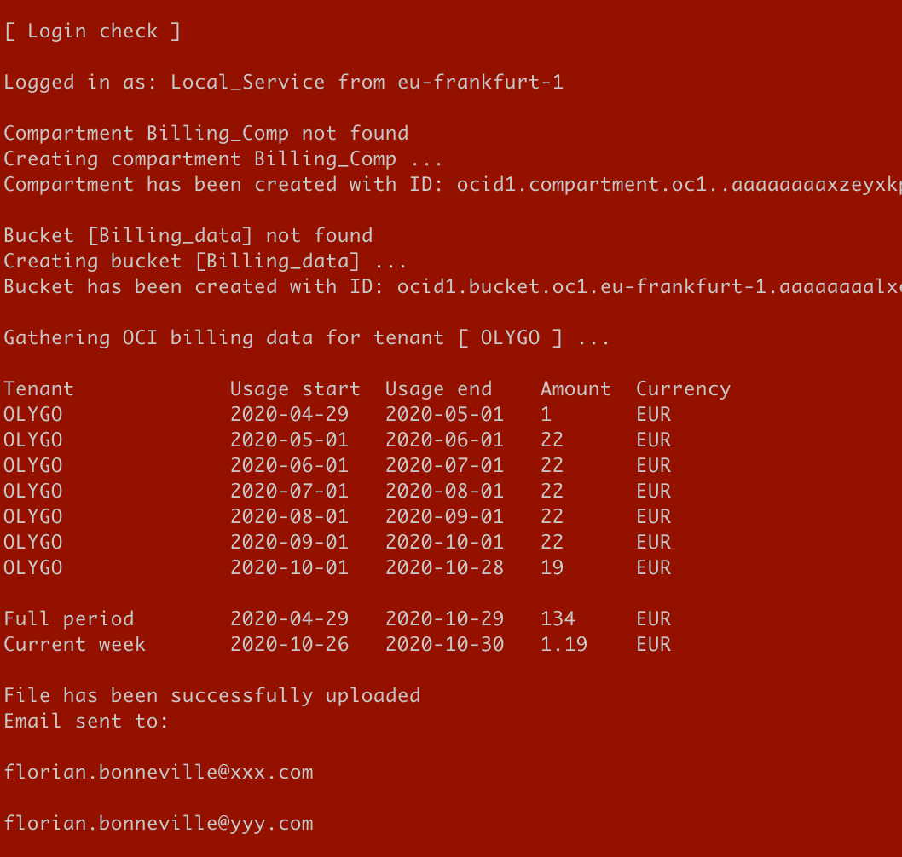
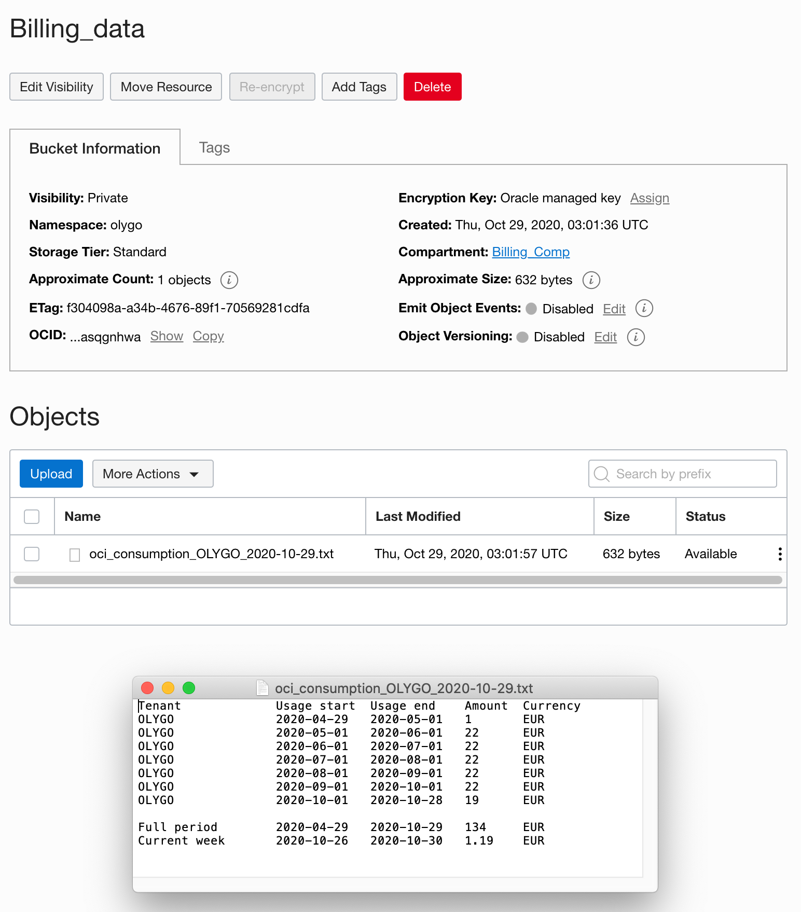
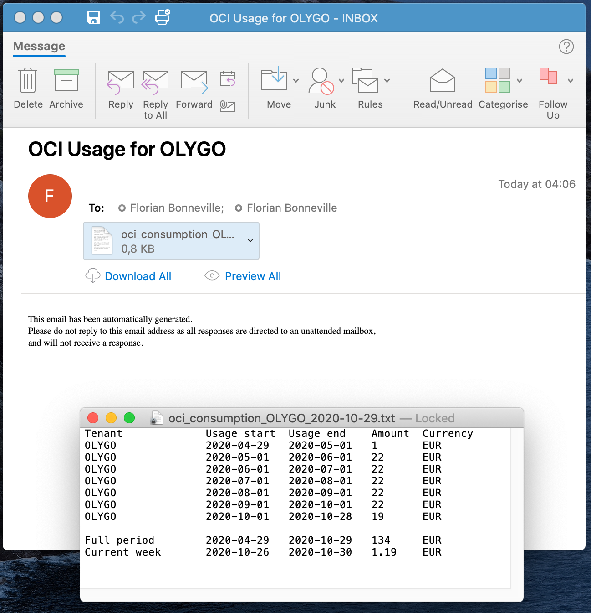

# oci-get-cost

Get OCI consumption for the last 6 months (default)

	python3 ./oci-get-cost.py

Get OCI consumption for a given period (using 2 arguments), date range must not be more than 365 days

	python3 ./oci-get-cost.py 2020-09-01 2020-10-01

Get OCI consumption from a specific date (using 1 argument), until current day
	
	python3 ./oci-get-cost.py 2020-09-01

This script records consumption logs into a bucket and/or sends it through email using SendGrid API

It creates both compartment & bucket if they don't exist

- It manages 3 authentication methods

		local_config_file, 
		instance_principal, 
		cloudshell

- Config file Authentication

        If OCI-CLI is installed, you can authenticate with your config file

        profile = "DEFAULT"
        configfile = "/home/opc/.oci/config"

- Config file example

        [DEFAULT]
        user=ocid1.user.oc1..aaaaaaaaxxxxxxxxxxxxxxxxxxxxxxxxxxxxxx
        fingerprint=76:22:76:5c:33:12:1b:5c:82:95:5c:11:0a:30:a0:07
        key_file=/home/opc/.oci/config/my_api_key.pem
        pass_phrase=here_your_key_file_passphrase
        tenancy=ocid1.tenancy.oc1..aaaaaaaaxxxxxxxxxxxxxxxxxxxxxxxxxxxxxx
        region=eu-frankfurt-1

		ref: https://docs.cloud.oracle.com/en-us/iaas/Content/API/SDKDocs/cliinstall.htm

- Launch from an OCI instance, using Instance Principal Authentication

        use_instance_principal = 'TRUE'
        tenancy_id_instance_principal = "ocid1.tenancy.oc1..aaaaaa..."
        
        ref: https://docs.cloud.oracle.com/en-us/iaas/Content/Identity/Tasks/callingservicesfrominstances.htm

- Launch from the OCI console, using CloudShell Authentication

        use_cloudshell_auth = 'TRUE'
        tenancy_id_instance_principal = "ocid1.tenancy.oc1..aaaaaa..."
        
        ref: hhttps://docs.cloud.oracle.com/en-us/iaas/Content/API/Concepts/cloudshellintro.htm

- Prerequisites

        - Linux instance
        - Python 3+
        - python3 -m pip install --upgrade oci-cli --user
        - python3 -m pip install --upgrade oci --user
        - python3 -m pip install sendgrid --user

	
	
	
	
	