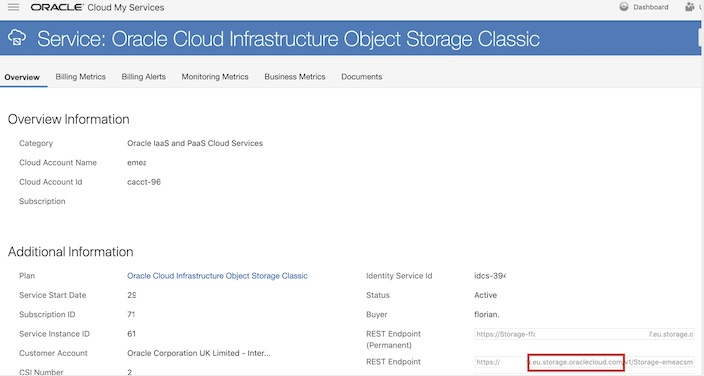

# ocic
ocic.sh: Use this script to download and/or delete objects from OCI-Classic object storage.

View a 60sec demo at https://objectstorage.eu-frankfurt-1.oraclecloud.com/n/olygo/b/ocic/o/demo.mp4

1- $ chmod +x ./ocic.sh

2- $ ./ocic.sh

Tested on OL 7.x and MacOS X

If you get authentication error, please check your RestEndpoint URl from Storage Classic Detail Page 

# Get your RestEnpoint:

