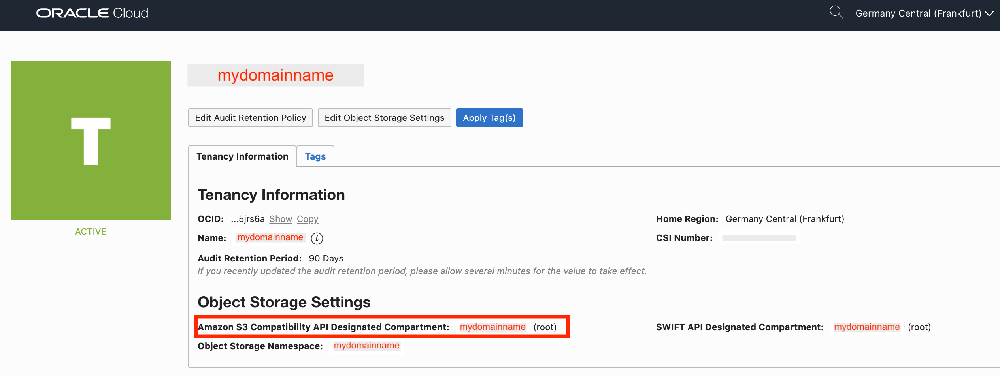
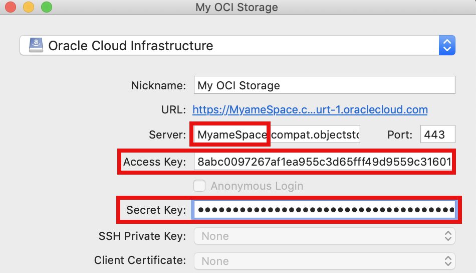
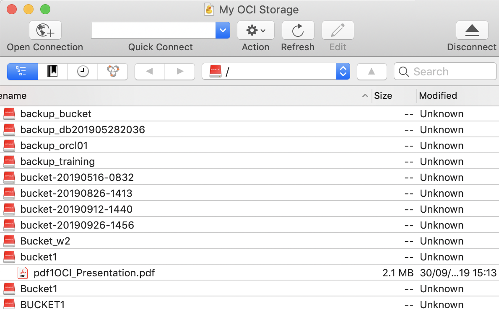

# OCI Object Storage with CyberDuck
<https://cyberduck.io>

OCI Object Storage is compatible with S3 Storage management tools such as CyberDUCK. You can either use S3 connection string with information provided below, or use the following CyberDuck OCI profiles.

### Download the CyberDuck OCI mark upped Profiles

<https://github.com/Olygo/OCI_Resources/raw/master/OCI_Object_Storage/CyberDuck_Profiles.zip>

### Open your OCI Console:

https://console.**eu-frankfurt-1**.oraclecloud.com?tenant=**YourOwnDomainName**

### Add a Customer Secret Key to your user:

<https://console.eu-frankfurt-1.oraclecloud.com/a/identity/users>

### Generate the Secret key:

### Copy the Secret key:

### Copy the Access key:

### Get your object storage namespace:

<https://console.eu-frankfurt-1.oraclecloud.com/a/tenancy/regions>

### Write down your own information such as:

	Customer Secret Key
	Name: MyStorageKey  
	SecretKey: MYXcL2IvjBCDq2S0IYxxxxxxxxxxxxxxxxxxxxx=
	AccessKey: e1b97f19ac165e0b9axxxxxxxxxxxxxxxxxxxxx
	Namespace: mydomainname

### Select the OCI region hosting your object storage
	
	
	Get OCI Regions list	
	https://docs.cloud.oracle.com/iaas/Content/General/Concepts/regions.htm#AboutRegionsandAvailabilityDomains
	
	Australia East (Sydney) 		=> ap-sydney-1
	Brazil East (Sao Paulo)			=> sa-saopaulo-1
	Canada Southeast (Toronto)		=> ca-toronto-1
	Germany Central (Frankfurt) 	=> eu-frankfurt-1
	India West (Mumbai)				=> ap-mumbai-1
	Japan East (Tokyo)				=> ap-tokyo-1
	South Korea Central (Seoul)		=> ap-seoul-1
	Switzerland North (Zurich)		=> eu-zurich-1
	UK South (London)				=> uk-london-1
	US East (Ashburn)				=> us-ashburn-1
	US West (Phoenix)				=> us-phoenix-1

## Open your OCI CyberDuck profile

## Alternatively, use CyberDuck S3 connection string

Server: **mydomainnamespace**.compat.objectstorage.**eu-frankfurt-1**.oraclecloud.com

Access Key ID: **8abc0097267af1ea95xxxxxxxxxxxxxxxx**

Secret Access Key: **jRnDTr20zFz+LFMFQSkPPu+xxxxxxxxxxxxxxxxxxxxx=**

	

